<h1 align="center">Pato Burguer</h1>

<h4 align="center"> 
	Concluído ✔️
</h4>

---

   <h2 align="center">Tópicos 📋</h2>

   <p>
   
   - [Sobre 📖](#sobre-)
   - [Layout Usuário 📱](#layout-usuário-)
   - [Layout Admin e Funcionário 📱](#layout-admin-e-funcionário-)
   - [Funcionalidades Admin e Funcionário 🛠️](#funcionalidades-admin-e-funcionário-%EF%B8%8F)
   - [Funcionalidades Usuário 🛠️](#funcionalidades-usuário-%EF%B8%8F)
   - [Tecnologias 📲](#tecnologias-)
   - [Como utilizar 🤔](#como-utilizar-)

   </p>

---

<h2 align="center">Sobre 📖</h2>
   
<p align="center">
  Buscando preencher a necessidade de um aplicativo que liste todo o cardápio de uma hamburgueria, o projeto tem como finalidade entregar dois aplicativos, sendo um para o usuário, onde o mesmo poderá ver todos os itens disponíveis por meio de uma interface intuitiva, simples e que vai lhe deixar com água na boca, e a partir do próprio app, ser redirecionado para o Whatsapp para realizar o pedido. E outro aplicativo para o uso dos administradores e funcionários, com o intuito de realizar alterações no cardápio, como adicionar/remover/alterar itens, ou até mesmo adicionar/remover/alterar promoções. Sendo que os administradores também tem uma funcionalidade exclusiva, lhes dando a possibilidade de adicionar e remover funcionários ou outros administradores.
</p>

---

<h2 align="center">Layout Usuário 📱</h2>
  
  <p align="center"> 
      
      
      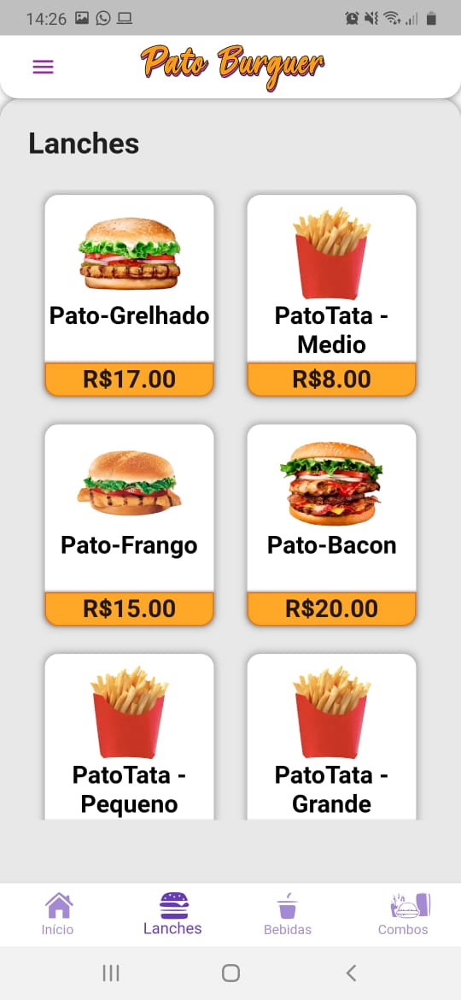
      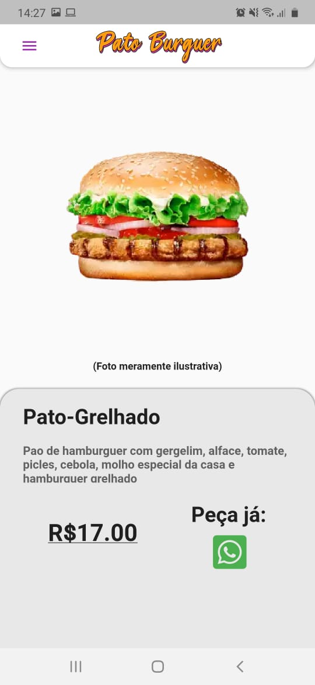
      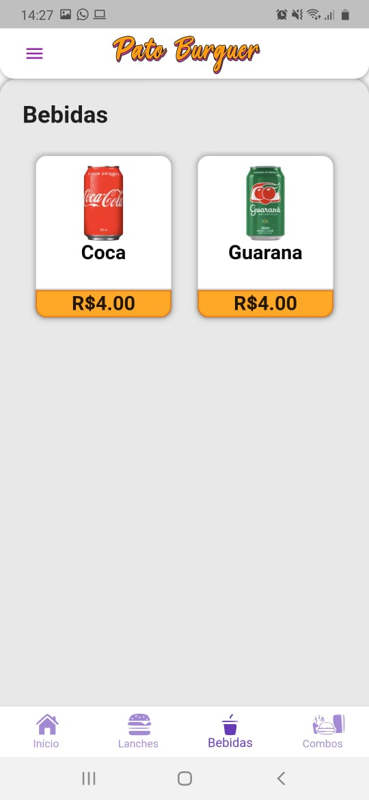
      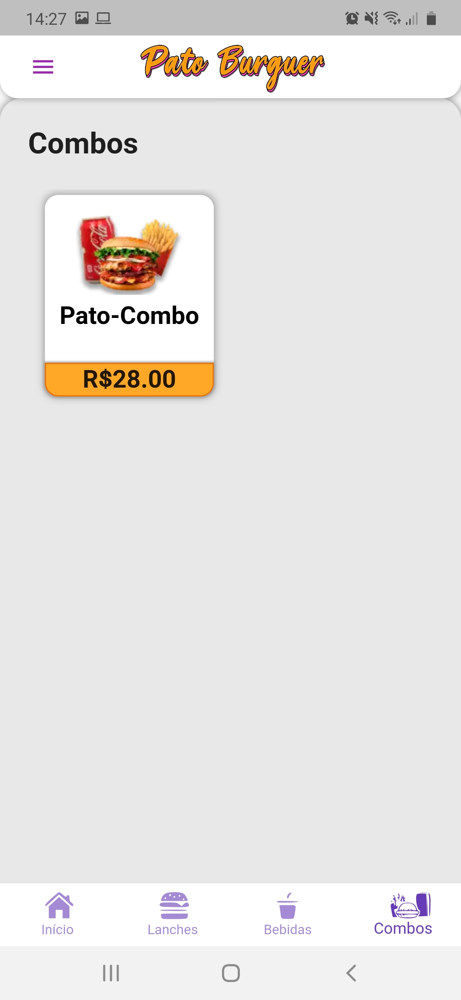
   </p>

---

<h2 align="center">Layout Admin e Funcionário 📱</h2>
   
   <p align="center"> 
      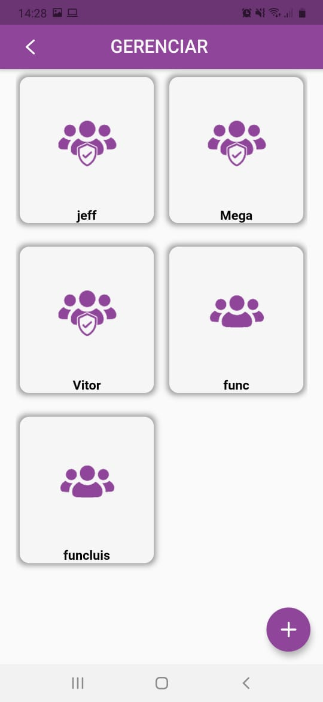
      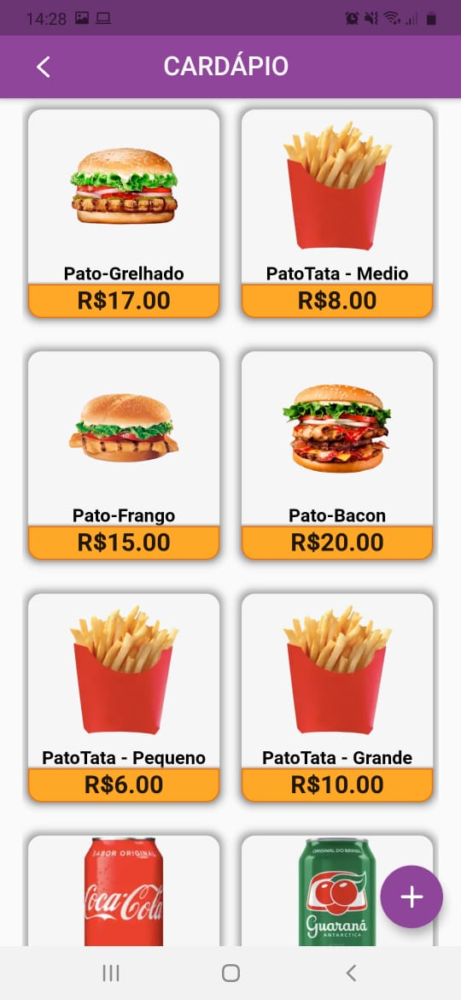
      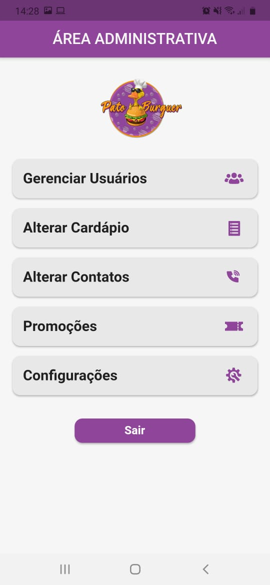
      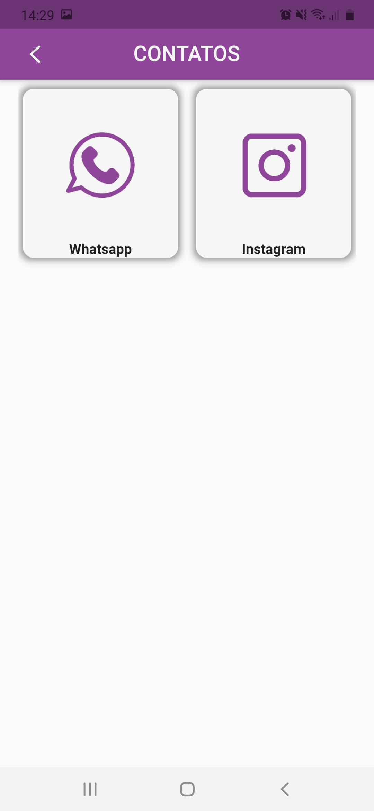
      
      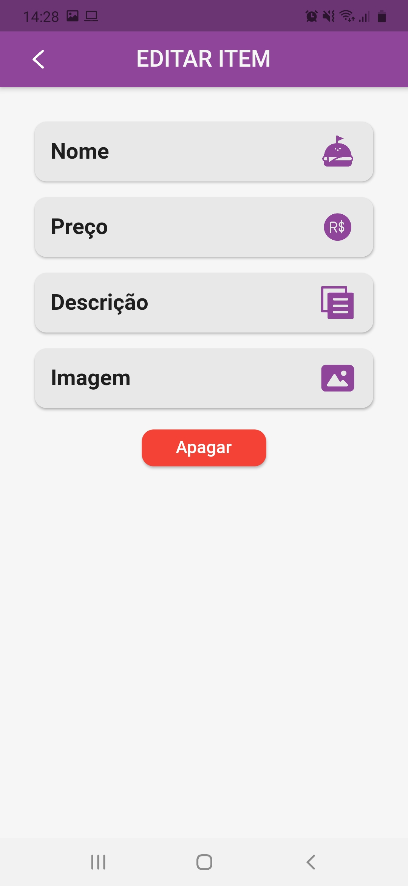
      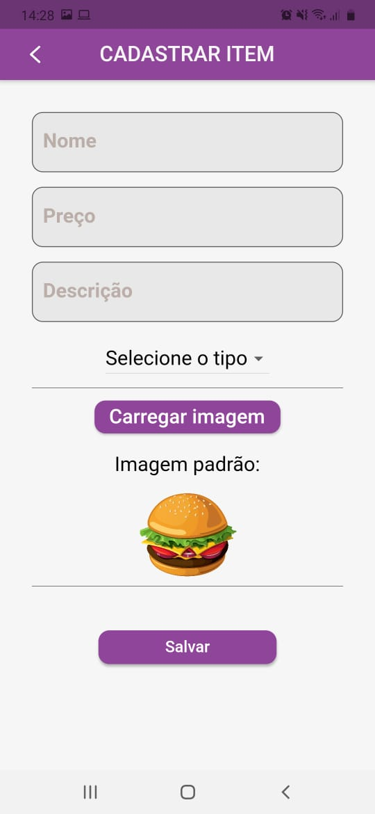
      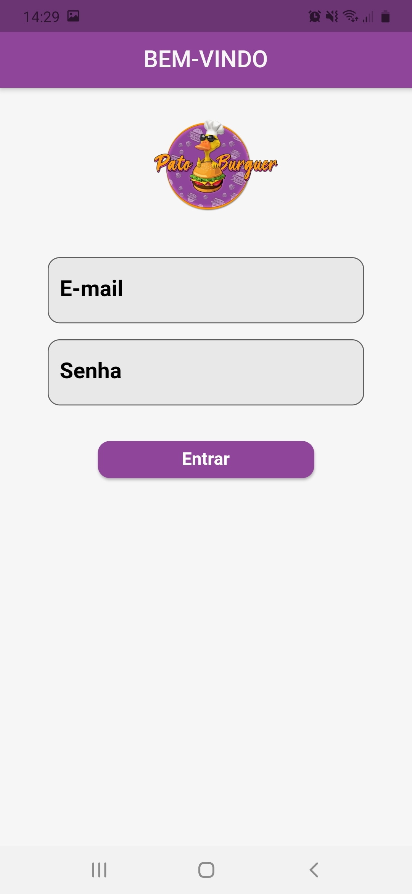
      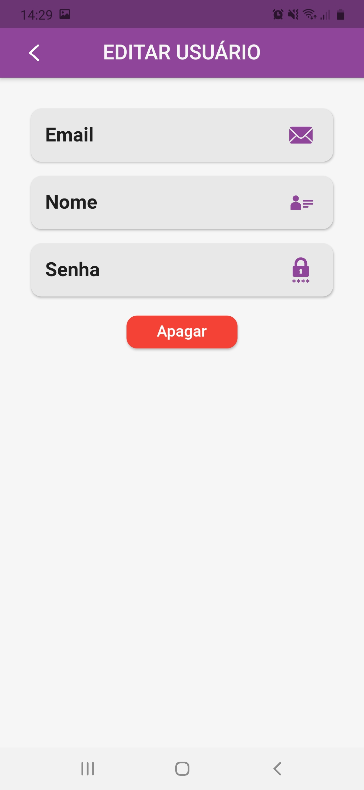
   </p>
   
---

<h2 align="center">Funcionalidades Admin e Funcionário 🛠️</h2>

   <p>

- Adicionar/remover/alterar itens,
- Adicionar/remover/alterar promoções,
- Adicionar/remover/alterar contatos
- Adicionar/remover/alterar funcionários e administradores,
- E outras que você pode tentar... 😉

   </p>

---

<h2 align="center">Funcionalidades Usuário 🛠️</h2>

   <p>

- Vizualizar todos os itens do cardápio,
- Filtrar cardápio para vizualizar categoria desejada,
- Vizualizar promoções,
- Vizualizar tela de detalhes do produto,
- Redirecionar a patir do ícone do Whatsapp para o contato de pedido.
- E outras que você pode tentar... 😉

   </p>

---

<h2 align="center">Tecnologias 📲</h2>

   <p>

-   **[DART](https://dart.dev)**
-   **[FLUTTER](https://flutter.dev)**
-   **[FIREBASE](https://firebase.google.com/?hl=pt-br)**

   </p>

---

<h2 align="center">Como utilizar 🤔</h2>

   ```
   - Clone este repositório:
   $ git clone https://github.com/icarogga/patoBurguer.git patoBurguer

   - Entre na pasta:
   $ cd patoBurguer

   - para instalar as dependências:
   $ flutter pub get

   - Execute o app: 
   $ flutter run
   ```

---

## 💪 Como contribuir para o projeto

1. Faça um **fork** do projeto.
2. Crie uma nova branch com as suas alterações: `git checkout -b my-feature`
3. Salve as alterações e crie uma mensagem de commit contando o que você fez: `git commit -m "feature: My new feature"`
4. Envie as suas alterações: `git push origin my-feature`
> Caso tenha alguma dúvida confira este [guia de como contribuir no GitHub](./CONTRIBUTING.md)

---

   >Este projeto foi desenvolvido com o ❤️ por **[@Ícaro Coêlho](https://github.com/icarogga?tab=following)**, **[@José Pedro](https://github.com/PeterYouseph)**, **[Letícia Yurie](https://github.com/leyurie)**, **[@Luis Gustavo](https://github.com/lgrotrab)**, **[@Vinicius Shinohara](https://github.com/ChuunibyouYuuta)**, **[@Vitor Vaz](https://github.com/vitorvazmaciel)**

---

## 📝 Licença

Este projeto esta sobe a licença [MIT](./LICENSE).


---
